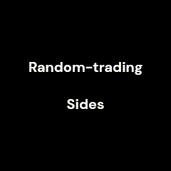

# Natural Computing Project
## Trading behaviour simulation

Organisms require a continuous supply of resources to survive. These resources need to be continuously replenished in the environment that these agents occupy, or else the population will starve to death. Many simply organisms constantly search for just food, and have nothing to gain from exchanging one resource type for another with fellow agents.

Human societies have evolved to produce and utilize different varieties of resources to aid in their survival through specialisation and uniqueness in traits and desires, but this comes with a problem. Our environment does not offer each desired resource in equal amounts at every place. Some resources are abundant in one location and completely lacking in another. The spatial organisation of humans and limited movement capabilities, along with the constantly changing needs and environment, lead to uneven distributions of wealth. As a result, humans developed a behaviour of trade, where a person sells goods that they own in abundance for goods that are are strongly desired but lacking with someone that has opposing resource in their disposal.

Studying how trading behaviour affects our population through controlled experiments is near-impossible to do. Epstein & Axtell (1996) [1] demonstrated the ability to do controlled experiments in artificial societies using textit{agent-based computer modeling. Although these simulations are necessarily abstractions of real-world societies, they allow for extensive experimentation with rule-based behaviours for studying emergent societal properties. In their book, they describe experiments with agents on a 2D grid, harvesting and consuming resources needed for survival. They show that different rule-based agent behaviours lead to changes in macroscopic societal properties. Among other behaviours, they looked at rules leading to trading behaviour, and the impact on societal patterns and statistics.

Wilhite (2001) [2] studied the effect of trading using several different network structures, as opposed to a 2D network where distances between agents and resources exist which have to be traversed. Their work investigated how different trade networks affect wealth distribution, and found there exists an optimal hybrid network organization between a heavily globalized market and a restricted localized market, where some agents trade globally, and most agents trade locally.

We will take aspects from both works by investigating the effects of different trading behaviours in a 2D grid world with resource and agent dynamics very similar to the experiments of Epstein \& Axtell. We focus on a bartering system, a simple form of trade where no money or other intermediate payment system is involved and at least two different kind of goods are exchanged. This method of exchange was practiced before money or a common intermediate exchange medium was used. An example of a bartering system in a centralized marketplace that still takes place today is investigated by Nyoko et al. (2022) [3].

We will show by means of experimentation the benefit that different trading behaviors can have on an artificial society by the survival rates in different environmental conditions.

Research questions:
- How is the survival rate of a pre-historic society affected by the ability to trade?
- How do different trading mechanisms and a centralized marketplace affect the survival rate?

## Research
#### Gifs: 
Some gifs of the simulations

#### Situations: 
| Situations | Description |
| ------ | ------ |
|  Random agents without trading  |  `Baseline, random agent, DISTRIBUTION, trading=false`  |
|  Random agents with trading  |  `Baseline, random agent, DISTRIBUTION, trading=true`  |
|  Agents pathfinding to nearest neighbor to trade  |  `Baseline, pathfind agent, DISTRIBUTION, trading=true`  |
|  Agents pathfinding to a central market place to trade  |  `Market, market agent, DISTRIBUTION, trading=true`  |

All situations are tested on three resource distributions: 
- All of one resource is on one side, and all of the other on the opposite side.
- All resources are randomly distributed in a grid structure.
- All resources are randomly uniformly distributed on all squares.

#### Analysis: 
Cox Proportional-Hazards model (also gives hazard ratio).

## Usage of simulation

The function `runSimulation()` is used to run the simulation. It requires the following arguments in its `args` parameter:

- `NUM_AGENTS`: (int) Total number of agents that are simulated.
- `SCENARIO`: (str) "Baseline" or "Market". Specifies whether a market is simulated.
- `AGENT_TYPE`: (str) "random" or "pathfind_neighbor" or "pathfind_market". Specifies whether the agent moves randomly all the time or it can pathfind either neighbors or to a market place.
- `MOVE_PROB`: (float) Probability of an agent making a move.
- `DISTRIBUTION`: (str) "Uniform" or "Sides" or "RandomGrid". Specifies which environment is used.
- `TRADING`: (boolean) Specifies whether agents are able to trade.
- `SAVE_TO_FILE`: (boolean) Whether to save the run as a CSV file.
- `RUN_NR`: (int) Specifies which run it is (only useful when calculating the mean over multiple runs).
- `run_time`: (str) Used as the folder name in which the run is saved.
- `ENABLE_RENDERING`: (boolean) Whether the run is displayed on the screen.

Running `simulation.py` generates data in `outputs/your_datetime`. These data are used in `evaluation.py`, where the data are processed and the figures are generated and analyses are run. The figures are saved in `imgs/your_datetime` and the analysis results are saved in `outputs/your_datetime/results`.

## Sources
[1] J. M. Epstein and R. Axtell, Growing artificial societies: social science from the bottom up.
Brookings Institution Press, 1996
[2] A. Wilhite, “Bilateral trade and ‘small-world’networks,” Computational economics, vol. 18, pp. 49–
64, 2001
[3] A. E. Nyoko, R. P. Fanggidae, and M. Ose, “The study of the barter trading system at wulandoni
barter market,” EAI, Jul. 2022. doi: 10.4108/eai.25-11-2021.2319357.