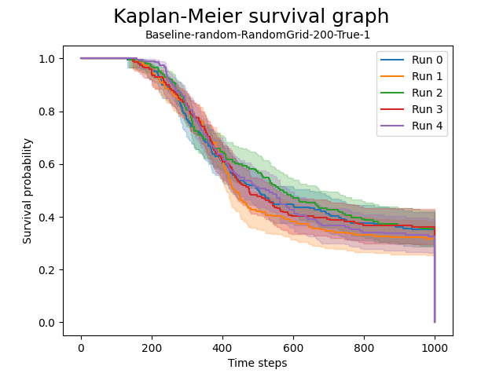

# Natural Computing Project
## Trading behaviour simulation

In a simulated environment of simple agents, we will examine the impact of transaction costs (TC) on
trading volume and the level of specialization among individual agents. These agents live in a world
where they both produce and consume resources necessary for survival, and they have the ability
to specialize to boost production of specific resources. Our model will be a simplified simulation of
trade and specialization behaviour for production. It could serve as a starting point for more complex
economic simulations to investigate the impact of policy interventions or changes in the underlying
mechanisms on trading volume. If time allows, we can look at the effects of additional variables, such
as the number of agents and changes in the behaviour on trading volume and specialization.

1. Can trading behaviour emerge using relatively simple decision rules in agents?
2. What is the effect of transaction cost on trading behaviour, measured in trading volume?
3. (Optional, if we do not make specialization fixed:) What is the effect of transaction cost on the
level of resource production specialization within the population?

## Research
#### Measurement: 
Kaplan-Meier survival distribution graph (KM-graph).

#### Situations: 
| Situations | Description |
| ------ | ------ |
|  Random agents without trading  |  `Baseline, random agent, DISTRIBUTION, trading=false`  |
|  Random agents with trading  |  `Baseline, random agent, DISTRIBUTION, trading=true`  |
|  Agents pathfinding to nearest neighbor to trade  |  `Baseline, pathfind agent, DISTRIBUTION, trading=true`  |
|  Agents pathfinding to a central market place to trade  |  `Market, market agent, DISTRIBUTION, trading=true`  |

All situations are tested on three resource distributions: 
- All of one resource is on one side, and all of the other on the opposite side.
- All resources are randomly distributed in a grid structure.
- All resources are randomly uniformly distributed on all squares.

#### Analysis: 
Cox Proportional-Hazards model (also gives hazard ratio).
